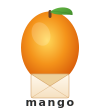

<div align="center">
  
  <h1>mango</h1>
  <p>Self-hosted Claude-powered daily email digest.<br/>Curates YouTube, RSS, APIs, and web pages into one sharp email.</p>
  <p>
    
    
    
    
  </p>
</div>

---

> Research shows mangoes are genuinely good for digestion. The catch is, too many of them will wreck your afternoon. The same principle applies here — an entirely customizable, AI-powered, self-curated digest keeps you feeling sharp. Fifteen bloated RSS feeds firing off every hour does not.

---

## How it works

```
YouTube · RSS · APIs · Web
          │
    Source Fetchers
    (parallel fetch)
          │
    Claude Agents
    researcher · vision · recommender
          │
    Jinja2 Renderer
    HTML + plain-text
          │
      Resend API
          │
        inbox
```

Each source is fetched in parallel, analyzed by a Claude model using your custom prompt directive, deduplicated against a SQLite cache, then rendered into a clean HTML email and delivered via Resend — daily, unattended.

**What gets fetched:**
- YouTube transcripts, key frames (vision analysis), and comments
- RSS feeds
- JSON API endpoints (with per-item URL templates)
- JS-rendered web pages via Playwright

**What you get:**
- Per-entity AI summaries driven by your own directives
- Optional "build vs. integrate" recommendations based on your active GitHub projects
- Deduplication across runs — you'll never see the same item twice
- Multi-user support — one YAML per person, all run in parallel

---

## Quick start

```bash
git clone https://github.com/jj-valentine/mango.git && cd mango

cp .env.example .env         # add ANTHROPIC_API_KEY + RESEND_API_KEY
cp config/entities.example.yaml config/yourname.yaml

uv run mango --user yourname --dry-run
```

Open the generated `digest_preview_yourname.html` in a browser. When it looks right, remove `--dry-run`.

---

## Configuration

Each file in `config/` maps to one recipient. Files matching `*example*` or starting with `_` are skipped.

```yaml
digest:
  email_to:   "you@example.com"
  email_from: "digest@yourdomain.com"
  subject:    "Daily Brief — {date}"

entities:
  - name: "Andrej Karpathy"
    description: "ML researcher and educator"
    model: "claude-sonnet-4-6"
    directive: |
      For each new video:
      1. Core thesis in 2 sentences
      2. Novel concepts introduced
      3. Any tools or code mentioned
    sources:
      - type: youtube
        url: "https://www.youtube.com/@AndrejKarpathy"
        max_videos: 3
        include_transcripts: true
        extract_frames: true

      - type: rss
        url: "https://karpathy.github.io/feed.xml"

  - name: "Hacker News"
    description: "Top tech stories"
    model: "claude-haiku-4-5"
    directive: "Summarise each story in one sentence. Flag anything AI/ML-related."
    sources:
      - type: api
        url: "https://hacker-news.firebaseio.com/v0/topstories.json"
        max_items: 10
        item_url: "https://hacker-news.firebaseio.com/v0/item/{id}.json"
```

<details>
<summary><strong>Full field reference</strong></summary>

| Field | Required | Description |
|---|---|---|
| `name` | yes | Entity label — used as the digest section heading and for dedup tracking. |
| `description` | yes | One-sentence context passed to Claude. |
| `model` | yes | Claude model ID. Use `claude-haiku-4-5` for cheap/simple, `claude-sonnet-4-6` for deeper analysis. |
| `directive` | yes | Freeform instruction appended to Claude's system prompt for this entity. |
| `include_comments` | no | Fetch and analyze comments (YouTube + API). Default: `false`. |
| `max_comments` | no | Upper bound on comments fetched (top-liked). |
| `sources[].type` | yes | One of `youtube`, `rss`, `api`, `web`. |
| `sources[].url` | yes | Source URL. For `api`, the list endpoint. |
| `sources[].max_videos` | youtube | Max videos to consider per run. |
| `sources[].include_transcripts` | youtube | Fetch auto-generated or manual transcripts. |
| `sources[].extract_frames` | youtube | Screenshot key frames for vision analysis. |
| `sources[].max_frames` | youtube | Max frames per video. |
| `sources[].enrichment_source` | youtube | Optional enrichment hook (e.g. `"nate_transcripts"`). |
| `sources[].max_items` | rss / api | Max items to fetch. |
| `sources[].item_url` | api | Per-item URL template — `{id}` is replaced with each item ID. |

</details>

<details>
<summary><strong>Projects (build vs. integrate recommendations)</strong></summary>

Add a `projects` block to have Claude read your active GitHub repos and append "build vs. integrate" recommendations based on what you're tracking:

```yaml
projects:
  - repo: "youruser/your-project"
    files: ["README.md", "CLAUDE.md"]
```

Claude reads the listed files after entity analysis and suggests whether a tool or library mentioned in the digest is worth building yourself or integrating directly.

</details>

---

## Multi-user

One YAML per user in `config/`:

```
config/
  alice.yaml
  bob.yaml
  james.yaml
```

```bash
uv run mango              # all users
uv run mango --user alice # one user
```

Each user gets an independent dedup DB at `data/seen_alice.db`.

---

## GitHub Actions

The workflow at `.github/workflows/daily-digest.yml` runs at 15:30 UTC daily and commits the updated dedup DB back to the repo after each run.

**Secrets to add** (Settings → Secrets → Actions):

| Secret | Required | Description |
|---|---|---|
| `ANTHROPIC_API_KEY` | yes | Claude API key |
| `RESEND_API_KEY` | yes | Resend API key |
| `GH_PAT` | no | GitHub PAT — only needed for private repos in `projects` |

**To change the schedule**, edit the cron in `.github/workflows/daily-digest.yml`:
```yaml
schedule:
  - cron: '30 15 * * *'  # 15:30 UTC daily
```

**To trigger manually:** Actions → Daily Email Digest → Run workflow.

---

## CLI

```bash
uv run mango [OPTIONS]
```

| Flag | Description |
|---|---|
| `--dry-run` | Skip send — writes HTML to project root instead |
| `--user NAME` | Run only `config/NAME.yaml` |
| `--entity NAME` | Run only the named entity (exact match) |
| `--config-dir DIR` | Config directory (default: `config/`) |
| `--config PATH` | Single YAML file (legacy mode) |

---

## Resend setup

1. Create an account at [resend.com](https://resend.com)
2. Verify your sending domain (DNS records — usually a few minutes)
3. Generate an API key → set as `RESEND_API_KEY`
4. Set `email_from` to an address on your verified domain

Use `--dry-run` to validate config before dealing with Resend.

---

## Environment

```bash
ANTHROPIC_API_KEY=sk-ant-...   # required
RESEND_API_KEY=re_...          # required for sending
GH_PAT=ghp_...                 # optional — private repos only
```

Place in `.env` (or `.env.local`) — both are auto-loaded.

---

## Stack

Python 3.12 · [Anthropic Claude](https://anthropic.com) · [yt-dlp](https://github.com/yt-dlp/yt-dlp) · [feedparser](https://feedparser.readthedocs.io) · [Playwright](https://playwright.dev/python/) · [Resend](https://resend.com) · SQLite · GitHub Actions

---

## License

MIT
